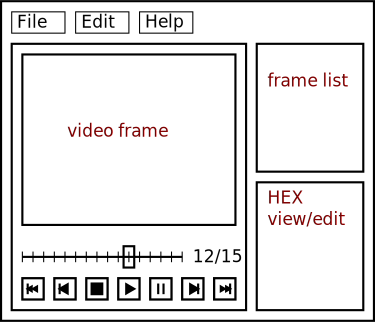
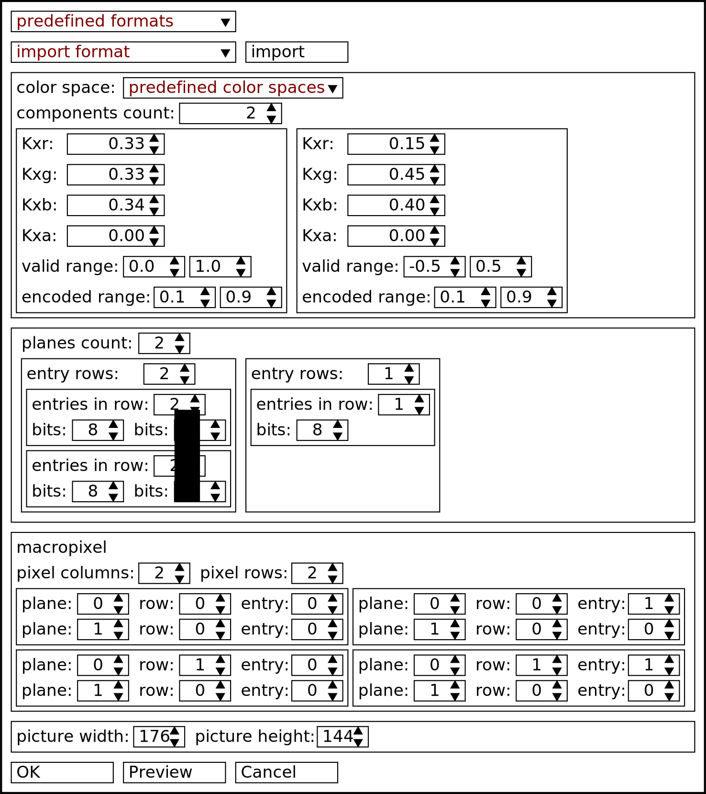

.. _gui:

GUI
***

There will be one main window for each application instance. Generally one instance should be used, but no limitation should be superimposed on the user.

The main window will consist of a menu and a tree view of files. Files can be nested in projects or standalone.

TODO: put an image of a window and an exemplary tree of files and projects

YUV view window
===============

This window will contain a view of a single YUV file.

.. _YUV_view_window:

   Scheme of YUV view window.

YUV comparison window
=====================

This window will be connected with two YUV view windows. The window will contain a view of an averaged YUV frame with differences marked.

Pixel format chooser dialog
===========================

This windows dialog will be shown after selecting a YUV file to open or when choosen from menu. The menu should allow for pixel format selection and preview. The pixel format parameters are described in section :ref:`pixel_format_representation`.

The first selection is "predefined format selection". When one of the predefined formats is selected only picture width and picture heigth settings should be available. When the special value "custom", is selected in "predefined format selection", "color space", "planes" and "macropixel" sections should be active.

In the color space part, :math:`K_{xr}`, :math:`K_{xg}`, :math:`K_{xb}`, :math:`K_{xa}` are values of coeffictients of inversed matrix :math:`M`. Each frame in the dialog is one column of matrix :math:`M^{-1}`. Vector :math:`N` is assumed to be 0. Valid range represents :math:`X_{i, min}` and :math:`X_{i, max}`. Coded range is :math:`\frac{x_{i, min}}{2 ^ \mathrm{bitwidth}}` and :math:`\frac{x_{i, max}}{2 ^ \mathrm{bitwidth}}`, where :math:`\mathrm{bitwidth}` is the number of bits used to represent given component in fixed bit-witdh integer form. (Note: :math:`M^{-1}` was used because this is the way it is specified in BT.xxx specifications. Might be better to switch to straight :math:`M`. It might be also decided to drop support for configurable color spaces and fall back to predefined only choices. This would allow for e.g. pallette coding and fixed point conversion functions.)

.. _format_chooser_dialog:

   Scheme of the pixel format chooser dialog.
